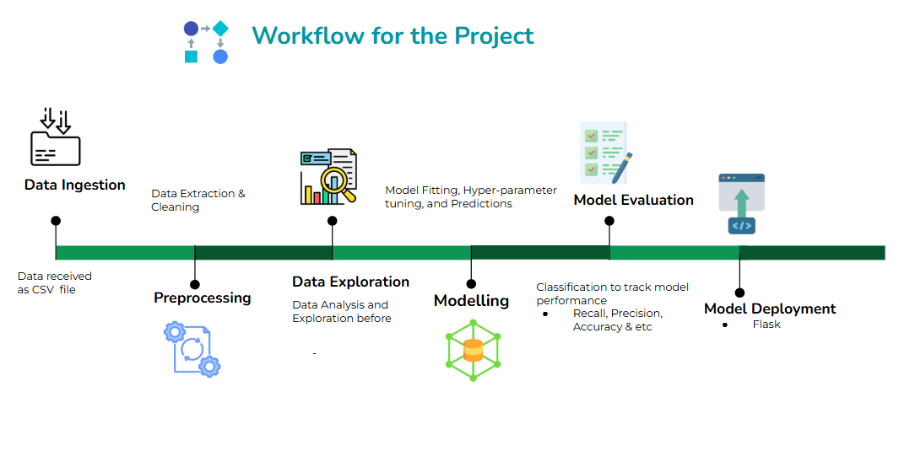

# **Twitter Sentiment Analysis & Prediction**

<!-- Table of Contents -->
## Table of Contents
- [Project Overview](#project-overview)
- [Architecture](#architecture)
- [Getting Started](#getting-started)
- [Licence](#license)
- [Contact](#contact)

<!-- ABOUT THE PROJECT -->
## Project Overview
This project aims to analyze the sentiment of tweets using machine learning techniques. The primary goal is to classify tweets as positive, negative, or neutral based on their content. The process involves several key steps: data collection, preprocessing, feature extraction, model training, and evaluation. Tweets are collected using the Twitter API and stored in a DataFrame. Preprocessing includes text normalization, tokenization, removal of stopwords, and vectorization using TF-IDF. A machine learning model, such as a logistic regression or a random forest classifier, is trained on the preprocessed data. The model's performance is evaluated using metrics like accuracy, precision, recall, and F1-score. The final model is then used to predict the sentiment of new tweets, providing valuable insights into public opinion on various topics.

<!-- Architecture -->
## Architecture
The project consists of two main architectures, each containing specific pipelines for different purposes:

- #### Training Pipeline Architecture
For training the model and consists of four components. The components are orchestrated using Airflow:
1. Data Ingestion: Download the datasets from kaggle.
2. Preprocessing: Apply preprocessing techiniques to the datasets.
3. Data Exploration: Analyzing the various characterstics of the dataset.
4. Model Training: Builds and trains the ship detection model.
5. Model Evaluation: Evaluates the performance of the trained model.
6. Model Deployment: Using a simple app built on Flask to showcase the model in action. 

  

